# WH40k Lore Bot Architecture Document

**Project:** WH40k Lore Discord Bot
**Version:** 1.0
**Date:** 2025-12-25
**Status:** Draft

---

## Table of Contents

- [Introduction](#introduction)
- [High Level Architecture](#high-level-architecture)
- [Tech Stack](#tech-stack)
- [Data Models](#data-models)
- [Components](#components)
- [External APIs](#external-apis)
- [Core Workflows](#core-workflows)
- [Database Schema](#database-schema)
- [Source Tree](#source-tree)
- [Infrastructure and Deployment](#infrastructure-and-deployment)
- [Error Handling Strategy](#error-handling-strategy)
- [Coding Standards](#coding-standards)
- [Test Strategy and Standards](#test-strategy-and-standards)
- [Security](#security)

---

## Introduction

This document outlines the overall project architecture for **WH40k Lore Bot**, including backend systems, shared services, and non-UI specific concerns. Its primary goal is to serve as the guiding architectural blueprint for AI-driven development, ensuring consistency and adherence to chosen patterns and technologies.

**Relationship to Frontend Architecture:**
This project is primarily a Discord bot (CLI-based interaction through Discord interface). While there may be future admin dashboard considerations, the core user interaction is via Discord commands and responses. Core technology stack choices documented herein are definitive for the entire project.

### Starter Template or Existing Project

**Current Status: Greenfield Project**

This is a new project being built from scratch. However, you bring valuable experience from a prior Python Discord bot with LLM+RAG implementation, which de-risks many technical decisions.

**Decision:** Manual setup from scratch - no heavy starter template needed for this greenfield project.

### Change Log

| Date | Version | Description | Author |
|------|---------|-------------|--------|
| 2025-12-25 | 1.0 | Initial architecture document | Winston (Architect Agent) |

---

## High Level Architecture

### Technical Summary

The WH40k Lore Bot is a **traditional server-based Discord bot** running on Debian, using a hybrid retrieval architecture (vector + BM25) with multi-LLM provider support. The system employs a **Central Orchestrator Pattern** that exposes a unified RAG query interface, enabling the same retrieval and generation flow from CLI tools, Discord bot handlers, and automated tests. The architecture scrapes and processes Warhammer 40K wiki content, stores it in a vector database with rich metadata, and responds to user queries in Hungarian (with English fallback) using on-the-fly translation. Core patterns include the orchestrator for flow coordination, repository abstraction for data access, multi-provider strategy for LLM flexibility, and metadata-driven retrieval for canon/speculation separation.

### High Level Overview

**Architectural Style:** **Monolithic Service with Central Orchestrator**

**Repository Structure:** **Monorepo** - Single repository containing:
- Core RAG orchestrator (central query service)
- Discord bot client (thin adapter)
- CLI tools (admin commands, testing)
- Wiki scraping/ingestion pipeline
- Shared utilities and types
- Infrastructure deployment scripts

**Service Architecture Decision:**
- **Phase 1 (MVP):** RAG Orchestrator + CLI interface for testing
- **Phase 2:** Discord bot adapter wrapping orchestrator
- **Phase 3:** Optional REST API for future admin dashboard
- **Deployment:** Single process on Debian VM, all components co-located

**Central Orchestrator Pattern:**
```
Entry Points → Orchestrator → RAG Pipeline → Response
    ↓              ↓                ↓
- CLI          Validate         Hybrid Retrieval
- Discord      Rate Limit       Metadata Filter
- Tests        Route            LLM Generation
- (Future API) Transform        Format Response
```

**Primary User Interaction Flow:**
1. User mentions bot or uses slash command in Discord (`/random-lore`, `/trivia`, `@Bot <question>`)
2. **Discord adapter** receives message, extracts query text
3. **Orchestrator.query(text, context)** invoked with user/server context
4. Orchestrator validates, applies rate limits, preprocesses query
5. RAG pipeline executes: **Hybrid retrieval** (vector + BM25) → Metadata filtering → Reranking → LLM generation
6. Orchestrator formats response with source attribution
7. **Discord adapter** translates to Hungarian (if needed), sends reply with follow-up buttons

**Key Architectural Decisions:**

1. **Central Orchestrator Pattern:** Single entry point (`QueryOrchestrator.process()`) called by CLI, Discord, tests. Ensures consistent behavior, simplifies testing, enables future API exposure without duplicating logic.

2. **Hybrid Retrieval (Vector + BM25):** Chosen over pure vector search to handle WH40K's extensive proper nouns (character names, factions, planets). Research shows 15-30% improvement for mixed query types.

3. **Multi-LLM Provider Support:** Base class with provider-specific implementations (OpenAI, Gemini, Claude, Grok, Mistral) enables cost optimization and quality testing without vendor lock-in.

4. **CLI-First MVP:** RAG pipeline validated standalone before Discord complexity. Enables rapid iteration on chunking, retrieval, and prompt engineering.

5. **On-the-Fly Translation:** VectorDB stores English wiki content, LLM translates responses to Hungarian during generation. More flexible than pre-translation, supports English fallback.

6. **Metadata-Driven Architecture:** Rich chunk metadata (faction, era, canon_flag, spoiler_flag, links array) enables filtering and cross-reference expansion without full knowledge graph complexity.

7. **Traditional Server Deployment:** Single Debian VM process. Simpler operations, lower latency (no cold starts), persistent in-memory caching possible.

### High Level Project Diagram


### Architectural and Design Patterns

**1. Central Orchestrator Pattern** ⭐
- **Description:** Single `QueryOrchestrator` service coordinates all RAG operations. Exposes unified interface: `process(query: str, context: QueryContext) -> Response`. All entry points (CLI, Discord, tests) call this orchestrator.
- **Rationale:** Ensures consistent validation, rate limiting, retrieval, and generation logic across all entry points. Simplifies testing (mock orchestrator), enables future API exposure, avoids code duplication.
- **Implementation:** Orchestrator owns RAG pipeline lifecycle, delegates to specialized services (retrieval, LLM routing, formatting), returns standardized response object.

**2. Adapter Pattern for Entry Points** ⭐
- **Description:** Discord bot, CLI, and future API are thin adapters that translate their input formats into orchestrator calls and translate responses back.
- **Rationale:** Keeps Discord-specific logic (slash commands, buttons, embeds) separate from core RAG logic. CLI can test same flows without Discord dependencies. New entry points (REST API, webhooks) trivial to add.

**3. Hybrid Retrieval Architecture (Vector + BM25)**
- **Description:** Combines dense semantic search (vector embeddings) with sparse keyword matching (BM25) using Reciprocal Rank Fusion
- **Rationale:** WH40K lore is proper noun-heavy. Hybrid handles both conceptual and exact-match queries. Research shows 15-30% improvement.

**4. Repository Pattern for Data Access**
- **Description:** Abstract vector DB and BM25 index access behind repository interfaces (`ChunkRepository`, `VectorRepository`, `BM25Repository`)
- **Rationale:** Enables testing with mocks, future migration from Chroma to Qdrant, separation of concerns

**5. Strategy Pattern for Multi-LLM Providers**
- **Description:** Base `LLMProvider` abstract class with concrete implementations (`OpenAIProvider`, `GeminiProvider`, etc.)
- **Rationale:** Proven pattern from your prior project. Enables cost/quality testing, avoids vendor lock-in

**6. Metadata-Driven Retrieval (Lightweight Graph-RAG)**
- **Description:** Store wiki hyperlinks as `links: []` array in chunk metadata, enable cross-reference expansion at query time
- **Rationale:** Preserves relationships without full knowledge graph complexity. Cost: <$5 vs $150+ for full graph extraction

**7. Event-Driven Logging & Analytics**
- **Description:** Async event emission for query logging, user feedback, trivia interactions
- **Rationale:** Non-blocking logging preserves response latency. SQLite for simple persistence on single-server deployment.

**8. Long-Running Process Architecture** ⭐
- **Description:** Single Python process runs continuously on Debian VM. Discord bot client, orchestrator, vector DB all in-process. Optional: Gunicorn/Uvicorn if REST API added.
- **Rationale:** Simple operations, no cold starts, enables in-memory caching (embedding models, BM25 index), lower latency. Systemd service for auto-restart.

---

## Tech Stack

**⚠️ CRITICAL: This section is the DEFINITIVE technology selection. All other documents, code, and agents MUST reference these exact choices and versions.**

### Cloud Infrastructure

- **Provider:** Self-Hosted Debian VM
- **Key Services:**
  - Compute: Single Debian 12 (Bookworm) virtual machine
  - Storage: Local filesystem for vector DB, SQLite, markdown archives
  - Networking: Public IP for Discord webhook/gateway, optional SSH bastion
- **Deployment Regions:** Single region (your VM location)

### Technology Stack Table

| Category | Technology | Version | Purpose | Rationale |
|----------|------------|---------|---------|-----------|
| **Language** | Python | 3.11.x | Primary development language | Stable LTS, excellent library support, your prior experience, wide RAG ecosystem |
| **Package Manager** | Poetry | 1.7+ | Dependency management and packaging | Modern lock files, reproducible builds, monorepo support, better than pip alone |
| **Discord Library** | discord.py | 2.3+ | Discord bot client and API wrapper | Most mature, extensive features, slash commands, your prior experience, active community |
| **Vector Database** | Chroma | 0.4.22+ | Embedded vector storage and similarity search | Simple embedded mode, zero-config for MVP, free, upgrade path to Qdrant if needed |
| **Vector Database (Future)** | Qdrant | 1.7+ (if needed) | Production vector DB with metadata filtering | Excellent metadata filtering, native hybrid search, self-hosted option, Python client |
| **BM25 Search** | rank-bm25 | 0.2.2 | Sparse keyword retrieval | Pure Python, simple, proven for hybrid search, no external dependencies |
| **Embedding API** | OpenAI Embeddings | text-embedding-3-small | Text-to-vector conversion | Best cost/quality ($0.00002/1K tokens), 1536-dim, well-supported, low latency |
| **LLM Provider (MVP)** | OpenAI API | Latest SDK | Primary LLM provider | GPT-4, GPT-3.5-turbo, proven quality, extensive API features |
| **LLM Providers (Phase 2)** | Google Gemini | Latest SDK | Cost-optimized LLM option | Competitive pricing, good Hungarian support, fast inference |
| | Anthropic Claude | Latest SDK | High-quality LLM option | Excellent reasoning, long context, good for complex lore queries |
| | xAI Grok | Latest SDK | Alternative LLM provider | Newer option, competitive features, diversification |
| | Mistral | Latest SDK | Open-weights LLM option | Cost-effective, European provider, good performance |
| **Web Scraping** | BeautifulSoup4 | 4.12+ | HTML parsing for wiki scraping | Flexible, simple API, perfect for wiki structure, wide adoption |
| | requests | 2.31+ | HTTP client for wiki fetching | Standard Python HTTP library, rate limiting support, reliable |
| | markdownify | 0.11+ | HTML to Markdown conversion | Clean conversion, preserves structure, enables archival |
| **Database (Logs/Trivia)** | SQLite | 3.40+ (Python stdlib) | Structured data persistence | Embedded, zero-config, perfect for single server, adequate for 300 users |
| **ORM** | SQLAlchemy | 2.0+ | Database abstraction layer | Type-safe, async support, migrations, repository pattern implementation |
| **Schema Migrations** | Alembic | 1.13+ | Database versioning and migrations | SQLAlchemy integration, version control for schema, team collaboration |
| **Testing Framework** | pytest | 8.0+ | Unit and integration testing | Industry standard, fixtures, parametrization, plugin ecosystem |
| **Test Coverage** | pytest-cov | 4.1+ | Code coverage measurement | Pytest integration, coverage reports, CI/CD friendly |
| **Mocking** | pytest-mock | 3.12+ | Test doubles and mocking | Clean mock API, pytest integration, simplifies testing LLM/DB calls |
| **Async Testing** | pytest-asyncio | 0.23+ | Testing async code | Essential for Discord bot and async orchestrator testing |
| **Linting** | ruff | 0.1+ | Fast Python linter and formatter | Extremely fast, replaces flake8+black+isort, modern rules |
| **Type Checking** | mypy | 1.8+ | Static type analysis | Catch bugs early, enforces type hints, improves IDE support |
| **Pre-commit** | pre-commit | 3.6+ | Git hook framework for linting | Automatic style/lint checks, prevents bad commits |
| **Environment Management** | python-dotenv | 1.0+ | Environment variable loading | Secure config management, separates secrets from code, 12-factor app |
| **Logging** | structlog | 24.1+ | Structured logging | JSON logs, context propagation, better than stdlib logging, analytics-ready |
| **Process Manager** | systemd | Native Debian | Service management and auto-restart | Built-in to Debian, reliable, auto-restart on failure, log management |
| **Evaluation Framework** | RAGAS | 0.1+ | RAG quality metrics | LLM-based evaluation, faithfulness/relevance metrics, no human labels needed |
| **Metrics Export** | prometheus-client | 0.19+ | Application metrics for monitoring | Standard metrics format, query latency tracking, operational visibility |
| **System Metrics** | node-exporter | 1.7+ | Server resource monitoring | CPU, memory, disk metrics, standard Prometheus exporter |
| **Admin Dashboard API (Phase 3)** | FastAPI | 0.109+ | REST API for admin dashboard | Modern async framework, auto-generated OpenAPI docs, fast, type-safe |
| **Admin Dashboard Frontend (Phase 3)** | htmx | 1.9+ | Dynamic frontend without heavy JS | Hypermedia-driven, minimal JS, simple server-side rendering, fast iteration |
| **Template Engine (Phase 3)** | Jinja2 | 3.1+ | HTML templating for admin dashboard | Industry standard, FastAPI integration, safe escaping, filters |

### Version Pinning Strategy

- **Exact pins for production:** Poetry lock file ensures exact versions across deployments
- **Minimum version notation (X.Y+):** Allows patch updates for security fixes
- **Major version locks:** Prevent breaking changes (e.g., discord.py 2.x, SQLAlchemy 2.x)
- **Review cadence:** Quarterly dependency updates, security patches immediate

### Backup Strategy

- **Markdown Archives:** Stored in `data/markdown-archive/` subdirectory (private sub-repo, version controlled, manually committed)
- **SQLite Databases:** Daily automated backup to `/opt/backups/`, manual file-based copy as needed
- **Vector DB:** Chroma embedded storage in `data/chroma-db/` (rebuildable from markdown archives)

---

## Data Models

Core data models represent the domain entities and their relationships.

### 1. WikiChunk (Core RAG Entity)

**Purpose:** Represents a single retrievable chunk of wiki content with rich metadata for filtering and cross-reference expansion.

**Key Attributes:**
- `chunk_id`: UUID - Unique identifier for the chunk
- `article_title`: str - Source wiki article name (e.g., "Roboute Guilliman")
- `section_heading`: str - Section hierarchy (e.g., "History > The Horus Heresy")
- `section_level`: int - Heading depth (1=h1, 2=h2, 3=h3)
- `content_text`: str - The actual chunk text content (200-500 tokens)
- `content_markdown`: str - Original markdown format with formatting preserved
- `embedding_vector`: List[float] - 1536-dim vector from OpenAI text-embedding-3-small
- `source_url`: str - Original wiki article URL
- `created_at`: datetime - When chunk was ingested
- `updated_at`: datetime - Last update timestamp

**Metadata Fields:**
- `faction`: Optional[str] - Primary faction (e.g., "Imperium", "Chaos", "Xenos")
- `subfaction`: Optional[str] - More specific (e.g., "Space Marines > Blood Angels")
- `character_names`: List[str] - Named entities mentioned (NER extracted)
- `era`: Optional[str] - Timeline period (e.g., "M31", "41st Millennium")
- `canon_flag`: bool - True if canonical lore, False if speculation/theory
- `canon_confidence`: float - 0.0-1.0 LLM classification confidence
- `spoiler_flag`: bool - Contains major plot reveals
- `content_type`: str - "narrative", "technical_specs", "timeline", "biography"
- `links`: List[str] - Wiki article titles hyperlinked from this chunk
- `source_books`: List[str] - Codex/novel references (if mentioned)

**Relationships:**
- Has embedding in VectorDB (1:1)
- Has BM25 indexed terms (1:many)
- Links to other chunks via `links` metadata (many:many, implicit)

### 2. QueryLog (Analytics & Quality Tracking)

**Purpose:** Records every user query for debugging, quality evaluation, and pattern analysis.

**Key Attributes:**
- `query_id`: UUID - Unique query identifier
- `timestamp`: datetime - When query was received
- `user_id`: str - Discord user ID
- `server_id`: str - Discord server ID
- `channel_id`: str - Discord channel ID
- `query_text`: str - Original user question
- `response_text`: str - Generated answer
- `chunks_retrieved`: List[UUID] - IDs of chunks used for context
- `retrieval_scores`: List[float] - Similarity scores for retrieved chunks
- `llm_provider`: str - Which LLM was used (e.g., "openai-gpt-3.5-turbo")
- `llm_tokens_prompt`: int - Tokens in prompt
- `llm_tokens_completion`: int - Tokens in completion
- `llm_cost_usd`: float - Estimated cost for this query
- `latency_retrieval_ms`: int - Time for retrieval phase
- `latency_llm_ms`: int - Time for LLM generation
- `latency_total_ms`: int - End-to-end latency
- `error_occurred`: bool - Did query fail?
- `error_message`: Optional[str] - Error details if failed

**Relationships:**
- References WikiChunks via `chunks_retrieved` (many:many)
- Has many UserFeedback entries (1:many)

### 3. UserFeedback (Quality Tracking)

**Purpose:** Stores user feedback (Helpful/Not Helpful button clicks).

**Key Attributes:**
- `feedback_id`: UUID - Unique identifier
- `query_id`: UUID - FK to QueryLog
- `user_id`: str - Discord user ID
- `feedback_type`: str - "helpful" or "not_helpful"
- `timestamp`: datetime - When feedback was given

**Relationships:**
- References QueryLog (many:1)

### 4. TriviaQuestion (Gamification)

**Purpose:** Stores trivia questions for engagement feature.

**Key Attributes:**
- `question_id`: UUID - Unique identifier
- `question_text`: str - The trivia question
- `correct_answer`: str - Correct answer text
- `wrong_answers`: List[str] - 2-3 incorrect options (multiple choice)
- `difficulty`: str - "easy", "medium", "hard"
- `topic`: str - Lore category (e.g., "Primarchs", "Horus Heresy")
- `source_chunk_id`: Optional[UUID] - Chunk question was generated from
- `created_at`: datetime - When question was created
- `created_by`: str - "llm_generated" or "admin_manual"
- `times_asked`: int - Usage counter
- `times_correct`: int - Number of correct answers
- `success_rate`: float - % of correct answers

**Relationships:**
- May reference WikiChunk as source (many:1)
- Has many TriviaAttempts (1:many)

### 5. TriviaAttempt (User Engagement Tracking)

**Purpose:** Tracks individual trivia attempts for leaderboard and analytics.

**Key Attributes:**
- `attempt_id`: UUID - Unique identifier
- `question_id`: UUID - FK to TriviaQuestion
- `user_id`: str - Discord user ID
- `server_id`: str - Discord server ID
- `timestamp`: datetime - When attempt was made
- `user_answer`: str - What user selected
- `is_correct`: bool - Did they get it right?
- `time_to_answer_seconds`: int - Response time
- `points_awarded`: int - Points gained (0 if wrong)

**Relationships:**
- References TriviaQuestion (many:1)
- Aggregates into Leaderboard (computed view)

### 6. Leaderboard (Computed/View)

**Purpose:** Monthly trivia rankings per server.

**Key Attributes:**
- `user_id`: str - Discord user ID
- `server_id`: str - Discord server ID
- `month`: str - "YYYY-MM" format
- `total_points`: int - Cumulative points
- `correct_answers`: int - Number correct
- `total_attempts`: int - Total questions attempted
- `success_rate`: float - Percentage correct
- `rank`: int - Position in leaderboard (computed)

**Relationships:**
- Derived from TriviaAttempts (aggregation)
- Reset monthly via admin command

### 7. ServerConfig (Multi-Server Settings)

**Purpose:** Per-server configuration for multi-community support.

**Key Attributes:**
- `server_id`: str - Discord server ID (PK)
- `server_name`: str - Discord server name (for reference)
- `llm_provider`: str - Preferred LLM provider for this server
- `llm_api_key_encrypted`: str - Server's own API key (future: per-server keys)
- `response_language`: str - Default language ("hu" or "en")
- `personality_mode`: str - Active personality file (e.g., "default", "grimdark_narrator")
- `rate_limit_per_user`: int - Queries per user per hour
- `rate_limit_per_server`: int - Queries per server per hour
- `canon_only_mode`: bool - Filter to canonical lore only
- `spoiler_free_mode`: bool - Exclude spoiler-flagged chunks
- `created_at`: datetime
- `updated_at`: datetime

**Relationships:**
- Has many QueryLogs (1:many)
- Has many TriviaAttempts (1:many)

---

## Components

Based on the Central Orchestrator architecture and defined data models, here are the major logical components organized by layer.

### Entry Layer Components

#### 1. Discord Bot Adapter
**Responsibility:** Thin adapter that translates Discord events into orchestrator calls and formats responses as Discord messages.

**Key Interfaces:**
- `on_message(message: discord.Message) -> None`
- `on_slash_command(interaction: discord.Interaction) -> None`
- `on_button_click(interaction: discord.Interaction) -> None`

**Dependencies:** Query Orchestrator, Trivia System, Server Config Repository

**Technology Stack:** discord.py 2.3+, Python asyncio

#### 2. CLI Adapter
**Responsibility:** Command-line interface for testing RAG pipeline, admin operations, and data ingestion.

**Key Interfaces:**
- `query(text: str, options: QueryOptions) -> str`
- `ingest_wiki(url: str, output_dir: str) -> None`
- `build_index(markdown_dir: str) -> None`
- `evaluate(queries_file: str) -> EvaluationReport`

**Dependencies:** Query Orchestrator, Wiki Scraper, Embedding Service

**Technology Stack:** Click/Typer, Rich for output

#### 3. Admin Dashboard API (Phase 3)
**Responsibility:** REST API for admin dashboard, exposes query logs, trivia management, server configuration.

**Key Interfaces:**
- `GET /api/queries?server_id={id}&limit={n}`
- `GET /api/trivia/leaderboard?server_id={id}&month={YYYY-MM}`
- `POST /api/trivia/questions`
- `GET /api/metrics`
- `PUT /api/servers/{id}/config`

**Dependencies:** Query Log Repository, Trivia Repository, Server Config Repository

**Technology Stack:** FastAPI 0.109+, Uvicorn, Jinja2, htmx

### Orchestration Layer

#### 4. Query Orchestrator ⭐ CENTRAL COMPONENT
**Responsibility:** Single entry point for all query processing. Coordinates validation, rate limiting, RAG pipeline, LLM generation, logging.

**Key Interfaces:**
- `async def process(query: QueryRequest) -> QueryResponse`

**Dependencies:** Query Validator, Rate Limiter, RAG Engine, Response Formatter, Query Logger

**Technology Stack:** Python 3.11 async/await, Dependency injection, structlog

### RAG Pipeline Layer

#### 5. RAG Engine
**Responsibility:** Executes retrieval-augmented generation pipeline: hybrid retrieval → metadata filtering → context expansion → LLM generation.

**Key Interfaces:**
- `async def generate_answer(query: str, filters: MetadataFilters) -> RAGResult`

**Dependencies:** Hybrid Retrieval Service, Metadata Filter, Context Expander, Multi-LLM Router

#### 6. Hybrid Retrieval Service
**Responsibility:** Combines vector search and BM25 keyword search using Reciprocal Rank Fusion.

**Key Interfaces:**
- `async def retrieve(query: str, top_k: int = 20) -> List[ScoredChunk]`

**Dependencies:** Vector Repository, BM25 Repository

**Technology Stack:** Asyncio for parallel retrieval, Custom RRF implementation

#### 7. Metadata Filter
**Responsibility:** Filters retrieved chunks based on server configuration (canon-only mode, spoiler-free mode).

**Key Interfaces:**
- `filter_chunks(chunks: List[WikiChunk], filters: MetadataFilters) -> List[WikiChunk]`

**Dependencies:** Server Config Repository

#### 8. Context Expander
**Responsibility:** Optionally expands retrieved chunks by following cross-references in `links` metadata field.

**Key Interfaces:**
- `expand_context(chunks: List[WikiChunk], expansion_depth: int = 1) -> List[WikiChunk]`

**Dependencies:** Vector Repository

### LLM Layer

#### 9. Multi-LLM Router
**Responsibility:** Selects appropriate LLM provider based on server config, routes generation requests, handles errors (no fallback - fail fast).

**Key Interfaces:**
- `async def generate(prompt: str, provider: str, options: GenerationOptions) -> LLMResponse`

**Dependencies:** LLM Provider implementations, Server Config Repository

**Technology Stack:** Strategy pattern, Retry logic with exponential backoff

#### 10. LLM Provider Implementations
**Responsibility:** Concrete implementations of base `LLMProvider` interface for each API.

**Providers:**
- `OpenAIProvider` (primary for MVP)
- `GeminiProvider` (Phase 2)
- `ClaudeProvider` (Phase 2)
- `GrokProvider` (Phase 2)
- `MistralProvider` (Phase 2)

**Key Interfaces (Base Class):**
- `async def generate(prompt: str, options: dict) -> str`
- `async def estimate_cost(prompt_tokens: int, completion_tokens: int) -> float`
- `get_provider_name() -> str`

**Dependencies:** Respective API SDKs

#### 11. Response Formatter
**Responsibility:** Formats LLM output into user-friendly response with source attribution, spoiler tags, follow-up buttons.

**Key Interfaces:**
- `format_discord_response(answer: str, sources: List[WikiChunk]) -> discord.Embed`
- `format_cli_response(answer: str, sources: List[WikiChunk]) -> str`

### Data Access Layer

#### 12. Vector Repository
**Responsibility:** Abstracts vector database operations (Chroma or Qdrant).

**Key Interfaces:**
- `async def search(query_vector: List[float], top_k: int, filters: dict) -> List[WikiChunk]`
- `async def upsert(chunks: List[WikiChunk]) -> None`
- `async def delete_by_article(article_title: str) -> None`

**Dependencies:** Chroma client

#### 13. BM25 Repository
**Responsibility:** Manages BM25 keyword index for sparse retrieval.

**Key Interfaces:**
- `search(query: str, top_k: int) -> List[Tuple[chunk_id, score]]`
- `build_index(chunks: List[WikiChunk]) -> None`
- `update_index(chunks: List[WikiChunk]) -> None`

**Dependencies:** rank-bm25 library

#### 14. Query Log Repository
**Responsibility:** Persists and retrieves query logs from SQLite.

**Key Interfaces:**
- `async def log_query(log: QueryLog) -> None`
- `async def get_recent_queries(server_id: str, limit: int) -> List[QueryLog]`

**Dependencies:** SQLAlchemy ORM, SQLite

#### 15. Trivia Repository
**Responsibility:** CRUD operations for trivia questions, attempts, leaderboards.

**Key Interfaces:**
- `async def get_random_question(difficulty: str, topic: str) -> TriviaQuestion`
- `async def record_attempt(attempt: TriviaAttempt) -> None`
- `async def get_leaderboard(server_id: str, month: str) -> List[LeaderboardEntry]`

**Dependencies:** SQLAlchemy ORM, SQLite

#### 16. Server Config Repository
**Responsibility:** Manages per-server configuration settings.

**Key Interfaces:**
- `async def get_config(server_id: str) -> ServerConfig`
- `async def update_config(server_id: str, updates: dict) -> None`

**Dependencies:** SQLAlchemy ORM, SQLite

### Supporting Services

#### 17. Query Validator
**Responsibility:** Validates query text for length, safety, content appropriateness, trivia anti-cheat.

**Key Interfaces:**
- `validate(query: str, server_id: str) -> ValidationResult`

**Validation Rules:**
- Min/max length (5-2000 characters)
- Basic profanity filter
- `is_current_trivia()` check to prevent trivia answer spoiling

#### 18. Rate Limiter
**Responsibility:** Enforces per-user and per-server rate limits.

**Key Interfaces:**
- `async def check_limit(user_id: str, server_id: str) -> bool`
- `async def record_request(user_id: str, server_id: str) -> None`

**Technology Stack:** Token bucket algorithm, in-process cache

#### 19. Query Logger
**Responsibility:** Asynchronous logging of queries to database without blocking response.

**Key Interfaces:**
- `async def log_query(query_log: QueryLog) -> None`

**Technology Stack:** Asyncio background task, batch writing

#### 20. Trivia System
**Responsibility:** Manages trivia question generation, answer validation, leaderboard updates.

**Key Interfaces:**
- `async def generate_question(topic: str, difficulty: str) -> TriviaQuestion`
- `async def validate_answer(question_id: UUID, user_answer: str) -> bool`
- `async def update_leaderboard(attempt: TriviaAttempt) -> None`

**Dependencies:** Trivia Repository, Multi-LLM Router, Vector Repository

### Data Ingestion Components (Offline)

#### 21. Wiki Scraper
**Responsibility:** Scrapes wiki HTML, converts to markdown, stores in archive directory.

**Key Interfaces:**
- `scrape_article(url: str) -> MarkdownArticle`
- `scrape_wiki_batch(article_urls: List[str], output_dir: str) -> ScrapingReport`

**Dependencies:** requests, BeautifulSoup4, markdownify

**Technology Stack:** Rate limiting (1 req/2s), User-agent headers

#### 22. Chunking Service
**Responsibility:** Splits markdown articles into section-based chunks with metadata.

**Key Interfaces:**
- `chunk_article(markdown: str, article_metadata: dict) -> List[ChunkWithMetadata]`

**Technology Stack:** Markdown parser, target chunk size 200-500 tokens

#### 23. Metadata Extractor
**Responsibility:** Extracts faction, era, canon_flag, links, character names from chunks.

**Key Interfaces:**
- `extract_metadata(chunk: Chunk, article_html: str) -> ChunkMetadata`

**Dependencies:** Optional spaCy for NER, LLM for canon classification

**Technology Stack:** Regex for links, LLM prompting for canon detection

#### 24. Embedding Service
**Responsibility:** Generates embeddings for chunks and stores in vector DB.

**Key Interfaces:**
- `async def embed_batch(chunks: List[str]) -> List[List[float]]`
- `async def embed_and_store(chunks: List[WikiChunk]) -> None`

**Dependencies:** OpenAI API, Vector Repository

**Technology Stack:** Batch embedding (up to 2048 texts per API call)

#### 25. Index Builder
**Responsibility:** Coordinates full index rebuild from markdown archives.

**Key Interfaces:**
- `async def rebuild_indexes(markdown_dir: str) -> IndexBuildReport`

**Dependencies:** Chunking Service, Metadata Extractor, Embedding Service, Vector Repository, BM25 Repository

---

## External APIs

The WH40k Lore Bot integrates with several external services.

### 1. Discord API

- **Purpose:** Real-time bot communication, message handling, slash commands, interactive components
- **Documentation:** https://discord.com/developers/docs/intro
- **Base URL(s):**
  - Gateway: `wss://gateway.discord.gg`
  - REST API: `https://discord.com/api/v10`
- **Authentication:** Bot Token (OAuth2)
  - Stored in environment: `DISCORD_BOT_TOKEN`
  - Format: `Authorization: Bot <token>`
- **Rate Limits:**
  - Global: 50 requests per second
  - Per-route: varies (e.g., 5 messages/5s per channel)

**Key Endpoints Used:**
- Gateway - WebSocket for real-time events
- `POST /channels/{channel_id}/messages` - Send responses
- `POST /interactions/{id}/{token}/callback` - Respond to slash commands

**Integration Notes:** Handled entirely by discord.py library

### 2. OpenAI API

- **Purpose:** Text embeddings (text-embedding-3-small) and LLM generation (GPT-3.5-turbo, GPT-4)
- **Documentation:** https://platform.openai.com/docs/api-reference
- **Base URL:** `https://api.openai.com/v1`
- **Authentication:** API Key (Bearer token)
  - Stored in environment: `OPENAI_API_KEY`
- **Rate Limits:** Tier-based (3,500 RPM typical)

**Key Endpoints Used:**
- `POST /embeddings` - Generate embeddings
  - Model: text-embedding-3-small
  - Cost: $0.00002 per 1K tokens
- `POST /chat/completions` - Generate answers
  - Models: GPT-3.5-turbo, GPT-4
  - Cost: $0.0005/$0.0015 per 1K tokens (GPT-3.5-turbo input/output)

**Integration Notes:** Use `openai` Python SDK v1.0+, exponential backoff for rate limits

### 3. Google Gemini API (Phase 2)

- **Purpose:** Alternative LLM provider for cost optimization
- **Documentation:** https://ai.google.dev/docs
- **Base URL:** `https://generativelanguage.googleapis.com/v1beta`
- **Authentication:** API Key (query parameter)
  - Stored in environment: `GEMINI_API_KEY`

**Integration Notes:** Use `google-generativeai` SDK, add in Phase 2

### 4. Anthropic Claude API (Phase 2)

- **Purpose:** High-quality LLM for complex lore queries
- **Documentation:** https://docs.anthropic.com/claude/reference/
- **Base URL:** `https://api.anthropic.com/v1`
- **Authentication:** API Key (header `x-api-key`)
  - Stored in environment: `ANTHROPIC_API_KEY`

**Integration Notes:** Use `anthropic` SDK, add in Phase 2

### 5. xAI Grok API (Phase 2)

- **Purpose:** Alternative LLM provider
- **Documentation:** https://docs.x.ai/
- **Base URL:** `https://api.x.ai/v1`
- **Authentication:** API Key (Bearer token)
  - Stored in environment: `XAI_API_KEY`

**Integration Notes:** OpenAI-compatible API, add in Phase 2

### 6. Mistral API (Phase 2)

- **Purpose:** Open-weights LLM option, European provider
- **Documentation:** https://docs.mistral.ai/api/
- **Base URL:** `https://api.mistral.ai/v1`
- **Authentication:** API Key (Bearer token)
  - Stored in environment: `MISTRAL_API_KEY`

**Integration Notes:** Use `mistralai` SDK, add in Phase 2

### 7. Warhammer 40K Wiki (Scraping - Not Official API)

- **Purpose:** Primary data source for lore content
- **Base URL(s):**
  - Option A: `https://warhammer40k.fandom.com` (Fandom Wiki)
  - Option B: `https://wh40k.lexicanum.com` (Lexicanum)
- **Authentication:** None (public web pages)
- **Rate Limits:** Self-imposed 1 request per 2 seconds

**Key Endpoints:**
- `GET /wiki/{Article_Title}` - Fetch individual articles

**Integration Notes:**
- Use requests + BeautifulSoup4
- Convert to Markdown with markdownify
- Store in `data/markdown-archive/` (private sub-repo)
- Legal: CC-BY-SA licensed, non-commercial use, attribution required

**Fallback Strategy:**
- Primary: Fandom Wiki
- Secondary: Lexicanum
- Tertiary: Frozen markdown archive

### API Cost Estimates (Monthly for 1000 Queries)

| API | Usage | Cost |
|-----|-------|------|
| OpenAI Embeddings | Full wiki (~50K chunks, one-time) | $1.00 |
| OpenAI GPT-3.5-turbo | 1000 queries | $1.25/mo |
| OpenAI GPT-4 | 1000 queries (if used) | $25.00/mo |
| Discord API | Free | $0.00 |

---

## Core Workflows

These sequence diagrams illustrate key system workflows.

### Workflow 1: User Query Processing (Happy Path)


**Latency Breakdown (Expected):**
- Validation + Rate Limit: ~5-10ms
- Hybrid Retrieval: ~50-100ms (parallel)
- Metadata Filtering: ~5ms
- Context Expansion: ~20-50ms
- LLM Generation: ~800-1500ms (dominant)
- Response Formatting: ~10ms
- **Total p95:** ~1.0-1.8s

### Workflow 2: Trivia Question Flow

```mermaid
sequenceDiagram
    actor User
    participant Discord as Discord Bot Adapter
    participant Trivia as Trivia System
    participant TriviaRepo as Trivia Repository
    participant VectorDB as Vector Repository
    participant LLMRouter as Multi-LLM Router

    User->>Discord: /trivia difficulty:medium
    Discord->>Trivia: generate_trivia_question()

    alt Existing Question
        Trivia->>TriviaRepo: get_random_question()
        TriviaRepo-->>Trivia: TriviaQuestion
    else Generate New
        Trivia->>VectorDB: search(topic_query)
        VectorDB-->>Trivia: lore_chunks[3]
        Trivia->>LLMRouter: generate_trivia()
        LLMRouter-->>Trivia: question + answers
        Trivia->>TriviaRepo: save_question()
    end

    Trivia-->>Discord: TriviaQuestion
    Discord->>User: Question with A/B/C/D buttons

    User->>Discord: Click button "B"
    Discord->>Trivia: validate_answer()

    alt Correct
        Trivia->>TriviaRepo: record_attempt(is_correct=True)
        Discord->>User: ✅ Correct! +10 points
    else Wrong
        Trivia->>TriviaRepo: record_attempt(is_correct=False)
        Discord->>User: ❌ Wrong. Correct: C
    end
```



### Workflow 3: Wiki Ingestion Pipeline (Offline)


**Time Estimate:** 8-12 hours for full wiki (10K articles)

### Workflow 4: Error Handling - Rate Limit Exceeded

```mermaid
sequenceDiagram
    actor User
    participant Discord as Discord Bot Adapter
    participant Orch as Query Orchestrator
    participant RL as Rate Limiter

    User->>Discord: @Bot "10th query in 1 minute"
    Discord->>Orch: process(QueryRequest)
    Orch->>RL: check_limit()
    RL-->>Orch: allowed=False, retry_after=3600
    Orch-->>Discord: RateLimitExceededError
    Discord->>User: ⏱️ Rate limit exceeded. Try in 60 min.
```



### Workflow 5: Error Handling - LLM API Failure (No Fallback)


**Note:** No fallback to alternative providers - fail fast approach.

---

## Database Schema

The system uses SQLite for relational data and Chroma for vector storage.

### SQLite Schema

**Database File:** `data/wh40k_lore_bot.db`

#### Table: query_logs

```sql
CREATE TABLE query_logs (
    query_id TEXT PRIMARY KEY,
    timestamp DATETIME NOT NULL DEFAULT CURRENT_TIMESTAMP,
    user_id TEXT NOT NULL,
    server_id TEXT NOT NULL,
    channel_id TEXT NOT NULL,
    query_text TEXT NOT NULL,
    response_text TEXT,
    chunks_retrieved TEXT,  -- JSON array
    retrieval_scores TEXT,  -- JSON array
    llm_provider TEXT NOT NULL,
    llm_tokens_prompt INTEGER,
    llm_tokens_completion INTEGER,
    llm_cost_usd REAL,
    latency_retrieval_ms INTEGER,
    latency_llm_ms INTEGER,
    latency_total_ms INTEGER,
    error_occurred BOOLEAN DEFAULT 0,
    error_message TEXT,

    INDEX idx_query_logs_server_timestamp (server_id, timestamp DESC),
    INDEX idx_query_logs_user_timestamp (user_id, timestamp DESC),
    INDEX idx_query_logs_error (error_occurred, timestamp DESC)
);
```

#### Table: user_feedback

```sql
CREATE TABLE user_feedback (
    feedback_id TEXT PRIMARY KEY,
    query_id TEXT NOT NULL,
    user_id TEXT NOT NULL,
    feedback_type TEXT NOT NULL CHECK (feedback_type IN ('helpful', 'not_helpful')),
    timestamp DATETIME NOT NULL DEFAULT CURRENT_TIMESTAMP,

    FOREIGN KEY (query_id) REFERENCES query_logs(query_id) ON DELETE CASCADE,
    INDEX idx_feedback_query (query_id),
    INDEX idx_feedback_user (user_id, timestamp DESC)
);
```

#### Table: trivia_questions

```sql
CREATE TABLE trivia_questions (
    question_id TEXT PRIMARY KEY,
    question_text TEXT NOT NULL,
    correct_answer TEXT NOT NULL,
    wrong_answers TEXT NOT NULL,  -- JSON array
    difficulty TEXT NOT NULL CHECK (difficulty IN ('easy', 'medium', 'hard')),
    topic TEXT NOT NULL,
    source_chunk_id TEXT,
    created_at DATETIME NOT NULL DEFAULT CURRENT_TIMESTAMP,
    created_by TEXT NOT NULL,
    times_asked INTEGER DEFAULT 0,
    times_correct INTEGER DEFAULT 0,
    success_rate REAL DEFAULT 0.0,

    INDEX idx_trivia_difficulty_topic (difficulty, topic),
    INDEX idx_trivia_success_rate (success_rate)
);
```

#### Table: trivia_attempts

```sql
CREATE TABLE trivia_attempts (
    attempt_id TEXT PRIMARY KEY,
    question_id TEXT NOT NULL,
    user_id TEXT NOT NULL,
    server_id TEXT NOT NULL,
    timestamp DATETIME NOT NULL DEFAULT CURRENT_TIMESTAMP,
    user_answer TEXT NOT NULL,
    is_correct BOOLEAN NOT NULL,
    time_to_answer_seconds INTEGER,
    points_awarded INTEGER NOT NULL DEFAULT 0,

    FOREIGN KEY (question_id) REFERENCES trivia_questions(question_id) ON DELETE CASCADE,
    INDEX idx_attempts_user_server (user_id, server_id, timestamp DESC),
    INDEX idx_attempts_question (question_id),
    INDEX idx_attempts_server_month (server_id, timestamp DESC)
);
```

#### Table: server_configs

```sql
CREATE TABLE server_configs (
    server_id TEXT PRIMARY KEY,
    server_name TEXT NOT NULL,
    llm_provider TEXT DEFAULT 'openai',
    llm_api_key_encrypted TEXT,
    response_language TEXT DEFAULT 'hu' CHECK (response_language IN ('hu', 'en')),
    personality_mode TEXT DEFAULT 'default',
    rate_limit_per_user INTEGER DEFAULT 10,
    rate_limit_per_server INTEGER DEFAULT 100,
    canon_only_mode BOOLEAN DEFAULT 0,
    spoiler_free_mode BOOLEAN DEFAULT 0,
    created_at DATETIME NOT NULL DEFAULT CURRENT_TIMESTAMP,
    updated_at DATETIME NOT NULL DEFAULT CURRENT_TIMESTAMP
);
```

#### View: leaderboard_monthly

```sql
CREATE VIEW leaderboard_monthly AS
SELECT
    user_id,
    server_id,
    strftime('%Y-%m', timestamp) AS month,
    SUM(points_awarded) AS total_points,
    SUM(CASE WHEN is_correct THEN 1 ELSE 0 END) AS correct_answers,
    COUNT(*) AS total_attempts,
    CAST(SUM(CASE WHEN is_correct THEN 1 ELSE 0 END) AS REAL) / COUNT(*) AS success_rate,
    ROW_NUMBER() OVER (
        PARTITION BY server_id, strftime('%Y-%m', timestamp)
        ORDER BY SUM(points_awarded) DESC
    ) AS rank
FROM trivia_attempts
GROUP BY user_id, server_id, month;
```

### Chroma Vector Database Schema

**Collection Name:** `wh40k_wiki_chunks`

**Embedding Dimensions:** 1536 (OpenAI text-embedding-3-small)

**Document Schema:**
```python
{
    "id": "uuid-string",
    "embedding": [0.123, -0.456, ...],  # 1536-dim
    "document": "chunk content text",

    "metadata": {
        "article_title": "Roboute Guilliman",
        "section_heading": "History > The Horus Heresy",
        "section_level": 2,
        "source_url": "https://...",
        "content_markdown": "# History...",
        "token_count": 450,
        "faction": "Imperium",
        "subfaction": "Space Marines > Ultramarines",
        "character_names": ["Roboute Guilliman", "Horus"],
        "era": "M31",
        "content_type": "biography",
        "canon_flag": true,
        "canon_confidence": 0.95,
        "spoiler_flag": false,
        "links": ["Ultramarines", "Primarch", "Horus Heresy"],
        "source_books": ["Codex: Space Marines 9th Ed"],
        "created_at": "2025-01-15T10:30:00Z",
        "updated_at": "2025-01-15T10:30:00Z"
    }
}
```

**Metadata Filtering Examples:**
```python
# Canon-only mode
collection.query(
    query_embeddings=[vector],
    where={"canon_flag": True}
)

# Complex filter
collection.query(
    query_embeddings=[vector],
    where={
        "$and": [
            {"canon_flag": True},
            {"spoiler_flag": False},
            {"era": "M31"}
        ]
    }
)
```

### Database Migrations

**Tool:** Alembic

**Migration Directory:** `src/migrations/`

**Commands:**
```bash
# Generate migration
alembic revision --autogenerate -m "description"

# Apply migrations
alembic upgrade head

# Rollback
alembic downgrade -1
```

### Backup and Restore

**SQLite Backup:**
```bash
# Daily automated backup
cp data/wh40k_lore_bot.db /opt/backups/wh40k_lore_bot_$(date +%Y%m%d).db
```

**Chroma Backup:**
- Copy `data/chroma-db/` directory
- Not critical (can rebuild from markdown archives)

**Markdown Archive:**
- Private Git repository in `data/markdown-archive/`
- Manually committed when scraping

**Disaster Recovery:**
1. Restore SQLite from backup
2. Rebuild Chroma from markdown archive (8-12 hours)

### Database Size Estimates

**SQLite (1 year, 10K queries/month):**
- query_logs: ~240MB
- user_feedback: ~12MB
- trivia_questions: ~500KB
- trivia_attempts: ~3MB
- **Total: ~255MB**

**Chroma (Full wiki):**
- 50K chunks × 11KB per chunk = ~550MB

**Overall Storage (Year 1): ~1GB**

---

## Source Tree

```
wh40k-lore-bot/
├── src/                                    # Application source
│   ├── adapters/                          # Entry points
│   │   ├── discord_adapter.py
│   │   ├── cli_adapter.py
│   │   └── api_adapter.py                 # Phase 3
│   │
│   ├── orchestration/                     # Central orchestrator
│   │   ├── query_orchestrator.py          # ⭐ Main
│   │   ├── query_validator.py
│   │   ├── rate_limiter.py
│   │   └── models.py
│   │
│   ├── rag/                               # RAG pipeline
│   │   ├── rag_engine.py
│   │   ├── hybrid_retrieval.py
│   │   ├── metadata_filter.py
│   │   ├── context_expander.py
│   │   └── fusion.py
│   │
│   ├── llm/                               # LLM layer
│   │   ├── llm_router.py
│   │   ├── base_provider.py
│   │   ├── providers/
│   │   │   ├── openai_provider.py
│   │   │   ├── gemini_provider.py         # Phase 2
│   │   │   ├── claude_provider.py         # Phase 2
│   │   │   ├── grok_provider.py           # Phase 2
│   │   │   └── mistral_provider.py        # Phase 2
│   │   └── response_formatter.py
│   │
│   ├── repositories/                      # Data access
│   │   ├── vector_repository.py
│   │   ├── bm25_repository.py
│   │   ├── query_log_repository.py
│   │   ├── trivia_repository.py
│   │   └── server_config_repository.py
│   │
│   ├── services/                          # Supporting
│   │   ├── query_logger.py
│   │   └── trivia_system.py
│   │
│   ├── ingestion/                         # Data pipeline
│   │   ├── wiki_scraper.py
│   │   ├── chunking_service.py
│   │   ├── metadata_extractor.py
│   │   ├── embedding_service.py
│   │   └── index_builder.py
│   │
│   ├── models/                            # Domain models
│   │   ├── wiki_chunk.py
│   │   ├── query_log.py
│   │   ├── trivia.py
│   │   ├── server_config.py
│   │   └── user_feedback.py
│   │
│   ├── utils/                             # Shared utilities
│   │   ├── logger.py
│   │   ├── config.py
│   │   ├── exceptions.py
│   │   └── metrics.py
│   │
│   ├── migrations/                        # DB migrations
│   │   └── versions/
│   │
│   ├── api/                               # Admin dashboard (Phase 3)
│   │   ├── main.py
│   │   ├── routes/
│   │   └── templates/
│   │
│   └── __main__.py                        # Entry point

├── tests/                                 # Test suite
│   ├── conftest.py
│   ├── unit/
│   ├── integration/
│   └── fixtures/

├── scripts/                               # Utility scripts
│   ├── ingest_wiki.sh
│   ├── rebuild_indexes.sh
│   ├── backup_databases.sh
│   └── migrate_database.sh

├── data/                                  # Data storage (gitignored)
│   ├── chroma-db/
│   ├── bm25-index/
│   ├── wh40k_lore_bot.db
│   ├── markdown-archive/                  # ⭐ Private sub-repo
│   ├── backups/
│   └── logs/

├── config/                                # Configuration
│   ├── .env.example
│   ├── wiki_urls.txt
│   └── personalities/

├── deployment/                            # Infrastructure
│   ├── systemd/
│   │   └── wh40k-lore-bot.service
│   ├── nginx/
│   └── monitoring/

├── docs/                                  # Documentation
│   ├── architecture.md                    # ⭐ This document
│   ├── brainstorming-session-results.md
│   └── rag-architecture-research-report.md

├── .bmad-core/                            # BMAD framework

├── pyproject.toml
├── poetry.lock
├── alembic.ini
├── .env
├── .gitignore
├── .pre-commit-config.yaml
├── README.md
└── LICENSE
```

### Import Conventions

**Absolute imports only:**
```python
from src.orchestration.query_orchestrator import QueryOrchestrator
from src.repositories.vector_repository import VectorRepository
```

### Entry Points

**Discord Bot:**
```bash
poetry run python -m src
```

**CLI Commands:**
```bash
poetry run python -m src.adapters.cli_adapter query "Who is Guilliman?"
poetry run python -m src.adapters.cli_adapter rebuild-indexes
```

---

## Infrastructure and Deployment

### Infrastructure as Code

- **Tool:** Bash scripts + systemd
- **Location:** `deployment/` and `scripts/`
- **Approach:** Manual provisioning with scripted configuration

### Deployment Strategy

**Strategy:** Blue-Green Manual Deployment

**Process:**
1. SSH to Debian VM
2. Clone new version to `/opt/wh40k-lore-bot-new/`
3. Install dependencies, run migrations
4. Stop service, swap directories
5. Start service, verify
6. Rollback if issues (reverse swap)

**Downtime:** ~30-60 seconds

### Environments

**Development:**
- Local laptop
- `.env.local`
- Test Discord bot

**Production:**
- Debian VM
- Production `.env`
- Main Discord bot
- Systemd-managed

### Environment Promotion Flow

```
Development (Local)
    ↓
Manual Testing
    ↓
Git Push
    ↓
Manual Deployment
    ↓
15 min Monitoring
    ↓
Rollback if issues
```

### Rollback Strategy

**Primary Method:** Directory swap

**Trigger Conditions:**
- Service fails to start
- Error rate >10% in 15 minutes
- Critical bug

**Rollback Script:**
```bash
#!/bin/bash
# deployment/rollback.sh
sudo systemctl stop wh40k-lore-bot
sudo mv /opt/wh40k-lore-bot /opt/wh40k-lore-bot-failed
sudo mv /opt/wh40k-lore-bot-backup-latest /opt/wh40k-lore-bot
sudo systemctl start wh40k-lore-bot
```

**RTO:** <5 minutes
**RPO:** Last deployment (no data loss)

### Monitoring

**Application Metrics (Prometheus):**
- Query total, duration, errors
- LLM requests, cost, tokens
- Retrieval chunks, latency

**System Monitoring:**
- Node exporter for CPU, memory, disk
- Access: `http://<server>:9100/metrics`

**Log Management:**
- JSON structured logs via structlog
- systemd journal captures output
- View: `sudo journalctl -u wh40k-lore-bot -f`
- Retention: 30 days

**Health Check:**
```bash
# /etc/cron.hourly/check-bot-health.sh
if ! systemctl is-active --quiet wh40k-lore-bot; then
    systemctl restart wh40k-lore-bot
fi
```

### Backup and Disaster Recovery

**Backup Schedule:**
```bash
# /etc/cron.daily/backup-wh40k-bot.sh
BACKUP_DIR="/opt/backups"
DATE=$(date +%Y%m%d)
cp /opt/wh40k-lore-bot/data/wh40k_lore_bot.db $BACKUP_DIR/wh40k_lore_bot_$DATE.db
find $BACKUP_DIR -name "*.db" -mtime +30 -delete
```

**Disaster Recovery:**
1. Provision new VM
2. Clone repo
3. Restore SQLite from backup
4. Restore markdown archive from Git
5. Rebuild Chroma indexes
6. Start service

**Recovery Time:** 2-4 hours

### Security Hardening

**Firewall:**
```bash
sudo ufw enable
sudo ufw allow 22/tcp
sudo ufw allow 8000/tcp  # Admin dashboard
sudo ufw default deny incoming
```

**SSH Hardening:**
```bash
# Disable root login
sudo sed -i 's/PermitRootLogin yes/PermitRootLogin no/' /etc/ssh/sshd_config
sudo systemctl restart ssh
```

**File Permissions:**
```bash
chmod 600 /opt/wh40k-lore-bot/.env
chmod 700 /opt/wh40k-lore-bot/data
```

### Systemd Service

**File:** `/etc/systemd/system/wh40k-lore-bot.service`

```ini
[Unit]
Description=WH40K Lore Discord Bot
After=network.target

[Service]
Type=simple
User=botuser
WorkingDirectory=/opt/wh40k-lore-bot
Environment="PATH=/opt/wh40k-lore-bot/.venv/bin"
ExecStart=/opt/wh40k-lore-bot/.venv/bin/python -m src
Restart=always
RestartSec=10

MemoryMax=2G
CPUQuota=150%

StandardOutput=journal
StandardError=journal

[Install]
WantedBy=multi-user.target
```

**Commands:**
```bash
sudo systemctl daemon-reload
sudo systemctl enable wh40k-lore-bot
sudo systemctl start wh40k-lore-bot
sudo systemctl status wh40k-lore-bot
```

---

## Error Handling Strategy

### General Approach

**Error Model:** Python exceptions with custom hierarchy

**Exception Hierarchy:**
```python
class WH40KBotError(Exception):
    """Base exception"""
    pass

# User-facing errors
class UserFacingError(WH40KBotError):
    pass

class RateLimitExceededError(UserFacingError):
    pass

class InvalidQueryError(UserFacingError):
    pass

class InsufficientCreditsError(UserFacingError):
    """LLM account has insufficient credits"""
    pass

# System errors
class SystemError(WH40KBotError):
    pass

class LLMProviderError(SystemError):
    pass

class DatabaseError(SystemError):
    pass

class RetrievalError(SystemError):
    pass

class ConfigurationError(SystemError):
    pass
```

**Error Propagation:**
1. Low-level components raise specific exceptions
2. Mid-level components catch and translate
3. Adapters catch all and present friendly messages
4. Never expose stack traces to users

### Logging Standards

**Library:** structlog 24.1+

**Format:** JSON structured logs

**Log Levels:**
- DEBUG: Detailed debugging
- INFO: General information
- WARNING: Unexpected but recoverable
- ERROR: Error conditions
- CRITICAL: System failures

**Required Context:**
- `query_id`: Correlation ID for tracing
- `component`: Which component logged
- `user_id`, `server_id`: User context

**Example:**
```python
from src.utils.logger import logger

logger.info("query_processed",
            query_id=query_id,
            user_id=user_id,
            latency_ms=total_ms)
```

### Error Handling Patterns

**External API Errors - Retry with Exponential Backoff:**
```python
async def generate_with_retry(provider, prompt, max_retries=3):
    for attempt in range(max_retries):
        try:
            return await provider.generate(prompt)
        except LLMProviderError as e:
            if e.is_retryable and attempt < max_retries - 1:
                wait = 2 ** attempt
                await asyncio.sleep(wait)
            else:
                raise
```

**No Fallbacks - Fail Fast:**
```python
# ❌ BAD - fallback to secondary provider
try:
    result = await openai_provider.generate(prompt)
except LLMProviderError:
    result = await gemini_provider.generate(prompt)

# ✅ GOOD - fail fast, no fallback
try:
    result = await llm_router.generate(prompt, provider="openai")
except LLMProviderError:
    logger.error("llm_failed")
    raise  # Re-raise, let user know it failed
```

**Business Logic Errors - Validate Early:**
```python
def validate(query_text: str, server_id: str) -> ValidationResult:
    # Length validation
    if not 5 <= len(query_text) <= 2000:
        return ValidationResult(False, "Query must be 5-2000 characters")

    # UTF-8 validation
    try:
        query_text.encode('utf-8').decode('utf-8')
    except UnicodeError:
        return ValidationResult(False, "Invalid encoding")

    # Basic profanity filter
    if contains_profanity(query_text):
        return ValidationResult(False, "Inappropriate content")

    # Trivia anti-cheat
    if is_current_trivia(query_text, server_id):
        return ValidationResult(False, "🎮 Can't ask about current trivia!")

    return ValidationResult(True)
```

### User-Facing Error Messages

| Exception | User Message |
|-----------|-------------|
| RateLimitExceededError | ⏱️ Rate limit exceeded. Try in {minutes} min. |
| InvalidQueryError | ❌ Invalid query: {reason} |
| InsufficientCreditsError | 💳 Bot's LLM credits insufficient. Contact admin. |
| LLMProviderError | 🤖 LLM service unavailable. Try later. |
| RetrievalError | 🔍 Unable to search database. Try later. |
| DatabaseError | ⚠️ Database error. Try later. |
| ConfigurationError | ⚙️ Configuration error. Contact admin. |
| UnexpectedError | ❌ Unexpected error occurred. Logged. |

---

## Coding Standards

**⚠️ CRITICAL: These standards are MANDATORY for all AI-generated code.**

### Core Standards

**Languages & Runtimes:**
- Python 3.11.x
- Bash for scripts only
- SQL via Alembic migrations

**Style & Linting:**
- Linter: ruff (replaces flake8, black, isort)
- Line length: 100 characters
- Pre-commit hooks: REQUIRED

**Type Checking:**
- Type hints REQUIRED for all function signatures
- Tool: mypy in strict mode

**Pre-Commit Configuration:**
```yaml
# .pre-commit-config.yaml
repos:
  - repo: https://github.com/astral-sh/ruff-pre-commit
    rev: v0.1.15
    hooks:
      - id: ruff
        args: [--fix]
      - id: ruff-format

  - repo: https://github.com/pre-commit/mirrors-mypy
    rev: v1.8.0
    hooks:
      - id: mypy

  - repo: https://github.com/PyCQA/bandit
    rev: 1.7.5
    hooks:
      - id: bandit
        args: ['-c', 'pyproject.toml']
```

### SOLID Principles - MANDATORY

**S - Single Responsibility:** One reason to change per class
**O - Open/Closed:** Extend via inheritance, not modification
**L - Liskov Substitution:** Subclasses substitutable for base
**I - Interface Segregation:** No unused methods in interfaces
**D - Dependency Inversion:** Depend on abstractions

### Naming Conventions

| Element | Convention | Example |
|---------|-----------|---------|
| Module/File | snake_case | `query_orchestrator.py` |
| Class | PascalCase | `QueryOrchestrator` |
| Function | snake_case | `def process_query()` |
| Variable | snake_case | `user_id` |
| Constant | UPPER_SNAKE_CASE | `MAX_RETRIES` |
| Private | _leading_underscore | `def _helper()` |

### Critical Rules

**1. Never use print() - use logger**
```python
# ❌ BAD
print(f"Processing: {query}")

# ✅ GOOD
logger.info("processing_query", query_text=query)
```

**2. All database ops via repositories**
```python
# ❌ BAD
result = await session.execute(select(QueryLog))

# ✅ GOOD
result = await query_log_repo.get_by_id(id)
```

**3. All LLM calls via router**
```python
# ❌ BAD
client = OpenAI()
response = client.chat.completions.create(...)

# ✅ GOOD
response = await llm_router.generate(prompt, provider="openai")
```

**4. Never hardcode secrets**
```python
# ❌ BAD
API_KEY = "sk-abc123"

# ✅ GOOD
API_KEY = os.getenv("OPENAI_API_KEY")
if not API_KEY:
    raise ConfigurationError("OPENAI_API_KEY not set")
```

**5. Use custom exception hierarchy**
```python
# ❌ BAD
raise Exception("Failed")

# ✅ GOOD
raise LLMProviderError("Generation failed", is_retryable=True)
```

**6. Await all async functions**
```python
# ❌ BAD
async def process():
    result = repo.get()  # Blocking!

# ✅ GOOD
async def process():
    result = await repo.get()
```

**7. No fallback logic - fail fast**
```python
# ❌ BAD
try:
    await provider_a.generate()
except:
    await provider_b.generate()  # No fallbacks!

# ✅ GOOD
await llm_router.generate()  # Fails if provider fails
```

**8. User-facing strings with emoji**
```python
# ❌ BAD
return "Error: rate limit"

# ✅ GOOD
return "⏱️ Rate limit exceeded. Try in 45 min."
```

**9. Use pathlib for files**
```python
# ❌ BAD
path = os.path.join("data", "file.json")

# ✅ GOOD
path = Path("data") / "file.json"
```

**10. SQL via Alembic only**
```python
# ❌ BAD
conn.execute("ALTER TABLE ...")

# ✅ GOOD
# alembic revision --autogenerate -m "add field"
# alembic upgrade head
```

**11. Never expose stack traces to users**
```python
# ❌ BAD
except Exception as e:
    await send_message(f"Error: {traceback.format_exc()}")

# ✅ GOOD
except Exception as e:
    logger.error("error", exc_info=True)
    await send_message("❌ Unexpected error occurred.")
```

**12. Use QueryResponse model**
```python
# ❌ BAD
return "Guilliman is..."

# ✅ GOOD
return QueryResponse(
    answer="Guilliman is...",
    sources=[chunk1, chunk2],
    metadata={"latency_ms": 1200}
)
```

**13. All imports at top level**
```python
# ❌ BAD
def process():
    from src.llm.router import LLMRouter

# ✅ GOOD
from src.llm.router import LLMRouter

def process():
    ...
```

**14. Avoid code duplication**
```python
# ❌ BAD - duplicated validation
def validate_query(q):
    if len(q) < 5: raise Error()
def validate_answer(a):
    if len(a) < 5: raise Error()

# ✅ GOOD - shared utility
def validate_min_length(text, min_len, field):
    if len(text) < min_len:
        raise InvalidError(f"{field} too short")
```

### Method and File Complexity

**Limits:**
- Methods: Max 50 statements
- Files: Max 500 statements
- Classes: Max 300 statements
- Cyclomatic complexity: Max 10

**Configuration (pyproject.toml):**
```toml
[tool.ruff]
line-length = 100

[tool.ruff.lint.mccabe]
max-complexity = 10

[tool.ruff.lint.pylint]
max-statements = 50
```

### Documentation

**Docstrings - Required for:**
- All public classes
- All public functions
- Complex internal functions

**Format - Google Style:**
```python
def retrieve_chunks(query: str, top_k: int = 20) -> List[WikiChunk]:
    """Retrieve chunks using hybrid search.

    Args:
        query: User question
        top_k: Number of chunks

    Returns:
        List of WikiChunk objects

    Raises:
        RetrievalError: If search fails
    """
```

### Import Organization

```python
# Standard library
import os
from datetime import datetime
from typing import List

# Third-party
import discord
from sqlalchemy.ext.asyncio import AsyncSession

# Local
from src.models.wiki_chunk import WikiChunk
from src.repositories.vector_repository import VectorRepository
```

### Git Commit Conventions

```
<type>: <description>

<optional body>
```

**Types:** feat, fix, refactor, test, docs, chore

**Examples:**
```
feat: add hybrid retrieval with BM25

fix: prevent trivia answer spoiling

refactor: extract validation to shared utility
```

---

## Test Strategy and Standards

### Testing Philosophy

**Principles:**
- **Test behavior, not implementation**
- **Integration over unit for complex flows**
- **Mock external APIs, use real DBs in tests**
- **No coverage targets - write tests that matter**

**Test behaviors:**
- ✅ Critical paths (query processing)
- ✅ Business logic (validation, RRF)
- ✅ Edge cases that reveal bugs

**Don't test:**
- ❌ Boilerplate (data classes, getters)
- ❌ Framework code (discord.py, Chroma)
- ❌ Presentation logic (string formatting)
- ❌ Library behavior (hashlib, uuid)

### Test Types

**Unit Tests:**
- Location: `tests/unit/`
- Mock external APIs
- Test pure functions, business logic
- Fast (<100ms)

**Integration Tests:**
- Location: `tests/integration/`
- Real SQLite in-memory
- Chroma test collection
- Mock LLM APIs
- Test RAG pipeline end-to-end

**Contract Tests (Phase 2):**
- Tag: `@pytest.mark.contract`
- Test real LLM APIs (2-3 per provider)
- **Not run by default** (slow, costs money)

**E2E Tests (Phase 2):**
- Tag: `@pytest.mark.e2e`
- Full Discord workflows (3-5 critical paths)
- **Not run by default** (slow, requires Discord)

**Running Tests:**
```bash
# Default - skip contract and e2e
poetry run pytest

# Run contract tests
poetry run pytest -m contract

# Run e2e tests
poetry run pytest -m e2e

# Run everything
poetry run pytest -m ""
```

### Test Organization

**AAA Pattern:**
```python
def test_validate_query_too_short():
    # Arrange
    validator = QueryValidator()
    query = "Hi"

    # Act
    result = validator.validate(query)

    # Assert
    assert not result.valid
    assert "too short" in result.error_message
```

**Fixture Example:**
```python
# tests/conftest.py
@pytest.fixture
async def test_db_session():
    engine = create_async_engine("sqlite+aiosqlite:///:memory:")
    async with engine.begin() as conn:
        await conn.run_sync(Base.metadata.create_all)
    async with AsyncSession(engine) as session:
        yield session
    await engine.dispose()
```

### When to Write Tests

**Write tests for:**
- ✅ New features (happy + 2-3 errors)
- ✅ Bug fixes (reproduce, then fix)
- ✅ Complex logic (RRF, validation)
- ✅ Critical paths (orchestrator)

**Don't test:**
- ❌ Boilerplate
- ❌ Framework code
- ❌ Trivial formatting
- ❌ Library wrappers

---

## Security

### Input Validation

**Validation Location:** Adapter boundaries (Discord, CLI)

**Rules:**
- Length: 5-2000 characters
- UTF-8 encoding validation
- Basic profanity filter
- Trivia anti-cheat: `is_current_trivia()` check

**Example:**
```python
def validate(query: str, server_id: str) -> ValidationResult:
    if not 5 <= len(query) <= 2000:
        return ValidationResult(False, "5-2000 chars required")

    if contains_profanity(query):
        return ValidationResult(False, "Inappropriate content")

    if is_current_trivia(query, server_id):
        return ValidationResult(False, "🎮 Can't ask about trivia!")

    return ValidationResult(True)
```

### Authentication & Authorization

**Authentication:** Discord OAuth2 (via discord.py)

**Bot Token:** Stored in `.env`, permissions `600`

**Authorization Levels:**
- Regular User: Query, trivia, leaderboard
- Server Admin: Reset leaderboard, manage trivia
- Bot Owner: All permissions, logs access

**Permission Checks:**
```python
if not interaction.user.guild_permissions.administrator:
    await interaction.response.send_message(
        "❌ Admin only", ephemeral=True
    )
    return
```

### Secrets Management

**Development:** `.env` file via python-dotenv

**Production:** `.env` in `/opt/wh40k-lore-bot/`, owned by botuser, `chmod 600`

**Code Requirements:**
```python
# ✅ GOOD
API_KEY = os.getenv("OPENAI_API_KEY")
if not API_KEY:
    raise ConfigurationError("OPENAI_API_KEY not set")

# ❌ BAD
API_KEY = "sk-abc123"
```

**Never in Logs:**
```python
# ❌ BAD
logger.info("request", api_key=API_KEY)

# ✅ GOOD
logger.info("request", provider="openai")
```

### API Security

**Rate Limiting:**
- Per-user: 10 queries/hour
- Per-server: 100 queries/hour
- Implementation: Token bucket, in-process cache

**HTTPS Enforcement:**
- Discord: Always HTTPS (discord.py)
- LLM APIs: Always HTTPS (SDKs)

### Data Protection

**Encryption at Rest:** Not encrypted (low-sensitivity public data)

**Encryption in Transit:**
- Discord: WSS
- LLM APIs: HTTPS

**PII Handling:**
- User IDs: Stored for rate limiting (necessary)
- Query text: Logged for debugging (30 day retention)
- No real names, emails collected

**Data Retention:**
- Query logs: 30 days (journald)
- DB logs: Indefinite (manual purge available)

**Logging Restrictions:**
```python
# ❌ BAD
logger.info("query", user_email="user@example.com")

# ✅ GOOD
logger.info("query", user_id=user_id, server_id=server_id)
```

### Dependency Security

**Scanning:** `pip-audit`

**Update Policy:**
- Security: Immediate (48 hours)
- Minor: Monthly
- Major: Quarterly

**Commands:**
```bash
poetry run pip-audit
poetry update
poetry show --outdated
```

### Security Testing

**SAST:** bandit (Python security linter)

**Pre-commit:**
```yaml
  - repo: https://github.com/PyCQA/bandit
    hooks:
      - id: bandit
```

**Security Checklist:**
- [ ] No secrets in code/logs
- [ ] All input validated
- [ ] Rate limiting enforced
- [ ] Dependencies scanned
- [ ] File permissions restricted
- [ ] SQL parameterized (ORM)
- [ ] Admin commands check perms

### Incident Response

**Procedure:**
1. **Detection:** Monitor logs, rate limits
2. **Containment:** Rotate compromised keys
3. **Investigation:** Review logs
4. **Recovery:** Restore from backup, hotfix
5. **Post-Mortem:** Document, update practices

---

🏗️ **Architecture Document Complete**

Generated by Winston (Architect Agent) using BMAD™ Core
