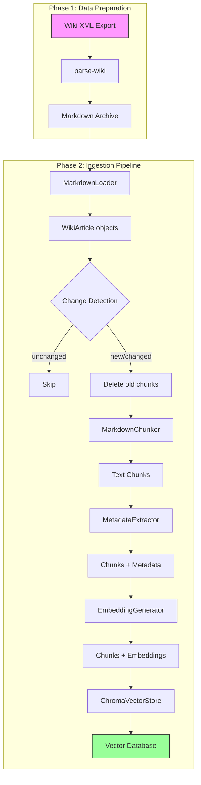

# WH40K Lore Bot - Ingestion Pipeline Guide

## Table of Contents

1. [Overview](#overview)
2. [Prerequisites](#prerequisites)
3. [Usage](#usage)
4. [Configuration](#configuration)
5. [Troubleshooting](#troubleshooting)
6. [Performance](#performance)
7. [Architecture](#architecture)
8. [FAQ](#faq)

---

## Overview

The ingestion pipeline transforms wiki articles into a searchable vector database for the WH40K Lore Bot. It uses a **two-phase architecture**:

### Phase 1: Data Preparation (One-Time)

1. **Parse XML** → Extract articles from MediaWiki XML export
2. **Convert** → Transform WikiText to Markdown
3. **Archive** → Save markdown files with YAML frontmatter

```bash
poetry run parse-wiki data/warhammer40k_pages_current.xml
```

### Phase 2: Ingestion Pipeline (Repeatable)

1. **Load Markdown** → Read from markdown archive with frontmatter
2. **Change Detection** → Skip unchanged articles (based on `last_updated`)
3. **Delete Old Chunks** → Remove previous chunks for changed articles
4. **Chunk** → Split articles into semantic chunks (50-500 tokens)
5. **Extract Metadata** → Identify factions, eras, characters, content types
6. **Generate Embeddings** → Create vector embeddings using OpenAI API
7. **Store** → Index chunks in Chroma vector database

```bash
poetry run ingest
```

**Input:** Markdown archive (data/markdown-archive/*.md)
**Output:** Searchable vector database with change tracking

---

## Prerequisites

### Required Dependencies

- **Python:** 3.11 or higher
- **Poetry:** 1.7+ for dependency management
- **OpenAI API Key:** For embedding generation

### Installation

```bash
# Clone repository
git clone <repository-url>
cd wh40k-lore-bot

# Install dependencies
poetry install

# Activate virtual environment
poetry shell
```

### Obtaining Wiki XML Export

1. Visit the [Warhammer 40K Fandom Wiki](https://warhammer40k.fandom.com)
2. Navigate to `Special:Export` or `Special:Statistics`
3. Download the complete wiki export (XML format)
4. Save to `data/warhammer40k_pages_current.xml`

Alternatively, use the provided test export in `data/` directory.

---

## Usage

### Basic Commands

#### Full Pipeline (Recommended)

Process the entire markdown archive:

```bash
poetry run ingest
```

**Expected output:**
- Processing time: 2-4 hours
- Chunks created: ~50,000
- Cost: ~$1.00 USD

#### Test Bed Ingestion

Process a subset of pages for development/testing:

```bash
# Step 1: Build test bed file (100 pages starting from seed)
poetry run build-test-bed data/warhammer40k_pages_current.xml --seed-id 58 --count 100

# Step 2: Parse XML to markdown archive (if not done)
poetry run parse-wiki data/warhammer40k_pages_current.xml

# Step 3: Ingest test bed only
poetry run ingest --wiki-ids-file data/test-bed-pages.txt
```

**Expected output:**
- Processing time: <5 minutes
- Chunks created: ~500
- Cost: ~$0.05 USD

### CLI Commands

| Command | Description |
|---------|-------------|
| `poetry run ingest` | Full ingestion pipeline (recommended) |
| `poetry run chunk` | Step 1: Chunk markdown to JSON |
| `poetry run embed` | Step 2: Generate embeddings from chunks JSON |
| `poetry run store` | Step 3: Store embeddings in Chroma |

### Database Analysis & Maintenance Commands

| Command | Description |
|---------|-------------|
| `poetry run stats-markdown` | Show markdown archive statistics (file counts, word counts) |
| `poetry run stats-db` | Show vector database statistics (chunk counts, token counts) |
| `poetry run show-chunk <chunk_id>` | Display full details of a specific chunk |
| `poetry run delete-chunk <chunk_id>` | Delete a specific chunk from both stores |
| `poetry run db-health` | Check health and consistency of SQLite and Chroma |
| `poetry run purge-db` | Delete ALL data from both stores (requires confirmation) |

### CLI Options (ingest command)

```bash
poetry run ingest --help
```

| Option | Type | Default | Description |
|--------|------|---------|-------------|
| `--archive-path` | PATH | `data/markdown-archive` | Markdown archive directory |
| `--batch-size` | INT | 100 | Articles processed per batch |
| `--wiki-ids-file` | PATH | none | File containing wiki IDs to process (one per line) |
| `--dry-run` | FLAG | false | Parse and chunk without generating embeddings |
| `--force` | FLAG | false | Re-ingest all articles (ignore change detection) |
| `--chroma-path` | STR | `data/chroma-db/` | Chroma vector database path |

### Usage Examples

#### Dry Run (No Embeddings)

Test pipeline without API costs:

```bash
poetry run ingest --dry-run --batch-size 10
```

#### Force Re-ingest All Articles

Ignore change detection and re-process everything:

```bash
poetry run ingest --force
```

#### Smaller Batches

Reduce memory usage for constrained environments:

```bash
poetry run ingest --batch-size 50
```

#### Custom Paths

Specify custom archive and database locations:

```bash
poetry run ingest \
    --archive-path /mnt/archive/ \
    --chroma-path /mnt/vector-db/
```

#### Step-by-Step Pipeline (Debugging)

Run each step separately for debugging:

```bash
poetry run chunk --output data/chunks.json
poetry run embed data/chunks.json --output data/embeddings.json
poetry run store data/embeddings.json
```

---

## Configuration

### Environment Variables

Create a `.env` file in the project root (see `.env.example`):

```bash
# OpenAI API Configuration (REQUIRED)
OPENAI_API_KEY=sk-your-api-key-here

# Database Configuration (Optional)
DATABASE_URL=sqlite:///data/wh40k-lore.db

# Logging Configuration (Optional)
LOG_LEVEL=INFO

# Chroma Database Path (Optional)
CHROMA_DB_PATH=data/chroma-db/
```

### OpenAI API Key Setup

1. Visit [OpenAI API Keys](https://platform.openai.com/api-keys)
2. Create a new API key
3. Add to `.env` file or export as environment variable:

```bash
export OPENAI_API_KEY="sk-your-api-key-here"
```

4. Verify configuration:

```bash
poetry run python -c "import os; print('API Key:', 'SET' if os.getenv('OPENAI_API_KEY') else 'MISSING')"
```

---

## Troubleshooting

### Common Errors

#### Error: `OPENAI_API_KEY not set`

**Cause:** OpenAI API key not configured

**Solution:**
```bash
# Create .env file
echo "OPENAI_API_KEY=sk-your-key-here" > .env

# Verify
poetry run python -c "import os; from dotenv import load_dotenv; load_dotenv(); print(os.getenv('OPENAI_API_KEY'))"
```

#### Error: `XML parsing failed`

**Cause:** Malformed or invalid XML file

**Solution:**
```bash
# Validate XML structure
xmllint --noout data/warhammer40k_pages_current.xml

# Re-download XML export if corrupted
```

#### Error: `Out of memory`

**Cause:** Batch size too large for available RAM

**Solution:**
```bash
# Reduce batch size
poetry run ingest --batch-size 50

# Monitor memory usage
watch -n 1 free -h
```

#### Error: `Rate limit exceeded (429)`

**Cause:** OpenAI API rate limit reached

**Solution:**
- Pipeline automatically retries with exponential backoff
- Wait 60 seconds for rate limit to reset
- Check [OpenAI rate limits](https://platform.openai.com/account/limits) for your tier

### Checking Logs

```bash
# View pipeline logs
tail -f logs/ingestion-errors.log

# View summary report
cat logs/ingestion-summary.json
```

### Resetting Database

**Option 1: Use the purge-db command (Recommended)**

```bash
# Delete all data from both Chroma and SQLite (requires confirmation)
poetry run purge-db

# Or with --force to skip confirmation
poetry run purge-db --force
```

**Option 2: Manual deletion**

```bash
# Delete Chroma database (WARNING: Destroys all data)
rm -rf data/chroma-db/

# Delete SQLite database
rm data/wh40k-lore.db
```

**After resetting, re-run ingestion:**

```bash
poetry run ingest --force
```

**Verify database health after reset:**

```bash
poetry run db-health
```

---

## Performance

### Full Wiki Ingestion

**Specifications:**
- **Input:** 173MB XML file, ~10,000 articles
- **Output:** ~50,000 chunks with embeddings

**Performance Metrics:**
- **Processing Time:** 2-4 hours
- **Memory Usage:** <500MB peak
- **Cost:** ~$1.00 USD (OpenAI API)
- **Tokens Used:** ~12,500,000

### Test Bed (100 Articles)

**Performance Metrics:**
- **Processing Time:** <5 minutes
- **Memory Usage:** <100MB peak
- **Cost:** ~$0.05 USD
- **Tokens Used:** ~125,000

### Performance Tips

1. **Use Test Bed for Development**
   - Iterate quickly with subset of pages
   - Avoid unnecessary API costs

2. **Adjust Batch Size**
   - Default: 100 articles per batch
   - Reduce for memory-constrained environments
   - Increase for faster processing (if RAM available)

3. **Use Dry Run**
   - Test pipeline without embedding generation
   - Validate parsing and chunking logic
   - No API costs

4. **Monitor Progress**
   - Watch tqdm progress bar for real-time updates
   - Check `logs/ingestion-summary.json` for final statistics

---

## Architecture

### Data Flow Diagram



### Components

#### MarkdownLoader

**Purpose:** Load markdown files from archive with YAML frontmatter parsing

**Input:** Markdown archive directory
**Output:** Iterator of `WikiArticle` objects

**Key Features:**
- YAML frontmatter extraction (title, wiki_id, last_updated, word_count)
- Wiki ID filtering support
- Statistics tracking (files loaded, skipped)

**Source:** [src/ingestion/markdown_loader.py](src/ingestion/markdown_loader.py)

#### WikiXMLParser (Data Preparation)

**Purpose:** Parse MediaWiki XML exports and convert to markdown (Phase 1 only)

**Input:** XML file
**Output:** Iterator of `WikiArticle` objects → saved to markdown archive

**Key Features:**
- Streaming parser (memory-efficient)
- WikiText → Markdown conversion
- Namespace filtering (main articles only)

**Source:** [src/ingestion/wiki_xml_parser.py](src/ingestion/wiki_xml_parser.py)

#### MarkdownChunker

**Purpose:** Split markdown into semantic chunks

**Input:** Markdown string
**Output:** List of `Chunk` objects

**Key Features:**
- Hierarchical splitting (sections → paragraphs → sentences)
- Token-aware chunking (50-500 tokens)
- Preserves section context

**Source:** [src/ingestion/text_chunker.py](src/ingestion/text_chunker.py)

#### MetadataExtractor

**Purpose:** Extract metadata from chunk content

**Input:** `Chunk` object
**Output:** Metadata dictionary

**Key Features:**
- Faction detection (keyword matching)
- Era detection (timeline analysis)
- Character name extraction (wiki links)
- Content type classification (lore, military, technology)
- Spoiler detection

**Source:** [src/ingestion/metadata_extractor.py](src/ingestion/metadata_extractor.py)

#### EmbeddingGenerator

**Purpose:** Generate vector embeddings using OpenAI API

**Input:** List of text strings
**Output:** List of numpy arrays (1536-dim)

**Key Features:**
- Batch processing (100 chunks per request)
- Automatic retry with exponential backoff
- Rate limiting (3000 RPM)
- Cost tracking

**Source:** [src/ingestion/embedding_generator.py](src/ingestion/embedding_generator.py)

#### ChromaVectorStore

**Purpose:** Store and query chunk embeddings

**Input:** Chunks + embeddings
**Output:** Persistent vector database

**Key Features:**
- Cosine similarity search
- Metadata filtering
- Batch insertion (1000 chunks per batch)

**Source:** [src/rag/vector_store.py](src/rag/vector_store.py)

---

## FAQ

### How to create a test bed for RAG fine-tuning?

Use the `build-test-bed` command to create a representative subset of pages:

```bash
# Build test bed starting from "Roboute Guilliman" (page ID 58)
poetry run build-test-bed data/warhammer40k_pages_current.xml \
    --seed-id 58 \
    --count 100 \
    --output data/test-bed-pages.txt

# Parse XML to create markdown archive (if not done)
poetry run parse-wiki data/warhammer40k_pages_current.xml

# Ingest test bed
poetry run ingest --wiki-ids-file data/test-bed-pages.txt
```

### How to ingest only specific pages?

Create a text file with one wiki ID per line:

```bash
# Create wiki IDs file
echo "58" > my-pages.txt
echo "123" >> my-pages.txt
echo "456" >> my-pages.txt

# Ingest specific pages
poetry run ingest --wiki-ids-file my-pages.txt
```

### How does change detection work?

The pipeline automatically detects changes using the `last_updated` timestamp from markdown frontmatter:

- **New articles:** Processed normally
- **Unchanged articles:** Skipped (same `last_updated`)
- **Changed articles:** Old chunks deleted, then re-ingested

To force re-ingest all articles regardless of changes:

```bash
poetry run ingest --force
```

### How to update existing data?

Simply re-run the ingestion pipeline:

```bash
poetry run ingest
```

The pipeline will:
1. Detect changed articles via `last_updated`
2. Delete old chunks for changed articles
3. Re-ingest only the changed content

### How to handle new wiki exports?

1. Download the latest XML export
2. Run parse-wiki to update markdown archive
3. Run ingest to process changes

```bash
# Download new export (manual step via Fandom wiki)
wget <new-export-url> -O data/warhammer40k_pages_current.xml

# Update markdown archive
poetry run parse-wiki data/warhammer40k_pages_current.xml

# Ingest changes (only changed articles will be processed)
poetry run ingest
```

### How much does ingestion cost?

**Full Wiki:**
- **Cost:** ~$1.00 USD
- **Tokens:** ~12.5 million
- **Model:** text-embedding-3-small ($0.02 per 1M tokens)

**Test Bed (100 pages):**
- **Cost:** ~$0.05 USD
- **Tokens:** ~125,000

**Cost Optimization:**
- Use `--dry-run` during development (no API costs)
- Use test bed for iterative development
- Monitor costs with `logs/ingestion-summary.json`

### What if I run out of OpenAI credits?

The pipeline will fail with authentication errors. Solutions:

1. **Add Credits:** Visit [OpenAI Billing](https://platform.openai.com/account/billing)
2. **Use Test Bed:** Process fewer pages to reduce costs
3. **Dry Run:** Test pipeline without embedding generation

---

## Additional Resources

- **Architecture Documentation:** [docs/architecture.md](architecture.md)
- **Coding Standards:** [docs/architecture/coding-standards.md](architecture/coding-standards.md)
- **Source Code:** [src/ingestion/](../src/ingestion/)
- **OpenAI API Docs:** [https://platform.openai.com/docs](https://platform.openai.com/docs)
- **Chroma Documentation:** [https://docs.trychroma.com](https://docs.trychroma.com)

---

*Last updated: December 31, 2025*
