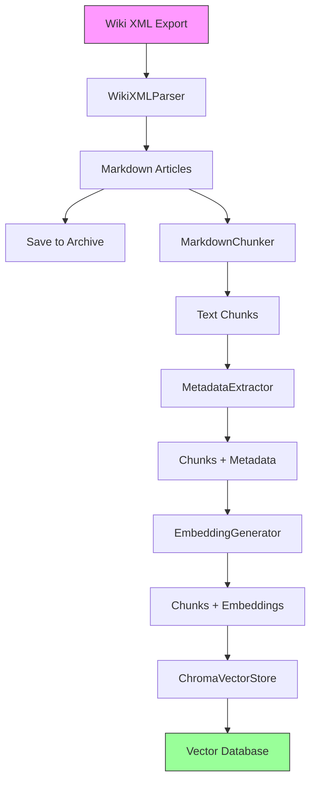

# Story 1.12: Ingestion Documentation & Usage Guide

## Status
Ready

## Story
**As a** future developer or user,
**I want** comprehensive documentation on the ingestion pipeline,
**so that** I can understand how it works and troubleshoot issues.

## Acceptance Criteria
1. `docs/ingestion-guide.md` created with sections:
   - **Overview:** High-level architecture diagram
   - **Prerequisites:** Dependencies, environment setup
   - **Usage:** CLI commands with examples
   - **Configuration:** Environment variables, config files
   - **Troubleshooting:** Common errors and solutions
   - **Performance:** Expected processing times, cost estimates
   - **Architecture:** Component diagram, data flow
2. Inline code documentation:
   - Docstrings for all public classes and methods (Google style)
   - Type hints on all function signatures
3. Example configuration file: `.env.example`
4. FAQ section covering:
   - How to create a test bed for RAG fine-tuning?
   - How to ingest only specific pages (via page ID filtering)?
   - How to resume failed ingestion?
   - How to update existing data?
   - How to handle new wiki exports?
   - How much does ingestion cost?
5. Architecture diagram (Mermaid format) showing data flow:
   ```
   XML → Parser → Markdown → Chunker → Chunks
                                         ↓
                                    Metadata Extractor
                                         ↓
                                    Embedding Generator
                                         ↓
                                    Chroma Vector Store
   ```

## Tasks / Subtasks

- [ ] Create ingestion guide document (AC: 1)
  - [ ] Create docs/ingestion-guide.md
  - [ ] Add front matter with title and description
  - [ ] Create table of contents
- [ ] Write Overview section (AC: 1)
  - [ ] Explain purpose of ingestion pipeline
  - [ ] High-level description of what it does
  - [ ] Link to architecture diagram
  - [ ] Explain input (XML) and output (vector DB)
- [ ] Write Prerequisites section (AC: 1)
  - [ ] List required dependencies (Poetry, Python 3.11+)
  - [ ] List external services needed (OpenAI API)
  - [ ] Explain how to obtain wiki XML export
  - [ ] Link to setup instructions in main README
- [ ] Write Usage section (AC: 1)
  - [ ] Document basic CLI command
  - [ ] Document all CLI options:
    - --batch-size
    - --skip-existing
    - --dry-run
    - --page-ids-file
  - [ ] Provide usage examples for common scenarios
  - [ ] Explain test bed creation and usage
- [ ] Write Configuration section (AC: 1)
  - [ ] Document environment variables:
    - OPENAI_API_KEY
    - DATABASE_URL
    - LOG_LEVEL
  - [ ] Explain .env file setup
  - [ ] Reference .env.example
  - [ ] Document any config files
- [ ] Write Troubleshooting section (AC: 1)
  - [ ] Common error: "OpenAI API key not set"
  - [ ] Common error: "XML parsing failed"
  - [ ] Common error: "Out of memory"
  - [ ] Common error: "Rate limit exceeded"
  - [ ] How to check logs
  - [ ] How to resume failed ingestion
  - [ ] How to reset database
- [ ] Write Performance section (AC: 1)
  - [ ] Expected processing time (2-4 hours for full wiki)
  - [ ] Expected memory usage (<500MB)
  - [ ] Expected cost (~$1.00 for full wiki)
  - [ ] Performance tips:
    - Use test bed for development
    - Adjust batch size for memory constraints
    - Use dry-run to test without embeddings
- [ ] Write Architecture section (AC: 1, 5)
  - [ ] Create Mermaid diagram showing data flow
  - [ ] Explain each component:
    - WikiXMLParser
    - MarkdownChunker
    - MetadataExtractor
    - EmbeddingGenerator
    - ChromaVectorStore
  - [ ] Explain data transformations at each step
  - [ ] Link to source code for each component
- [ ] Write FAQ section (AC: 4)
  - [ ] Q: How to create a test bed for RAG fine-tuning?
    - A: Use build-test-bed command with seed page
  - [ ] Q: How to ingest only specific pages?
    - A: Use --page-ids-file option
  - [ ] Q: How to resume failed ingestion?
    - A: Use --skip-existing flag
  - [ ] Q: How to update existing data?
    - A: Re-run ingestion (it will overwrite)
  - [ ] Q: How to handle new wiki exports?
    - A: Download new XML and re-run ingestion
  - [ ] Q: How much does ingestion cost?
    - A: ~$1.00 for full wiki, ~$0.05 for test bed
- [ ] Create .env.example file (AC: 3)
  - [ ] Add all required environment variables
  - [ ] Add comments explaining each variable
  - [ ] Add example values (not real secrets)
  - [ ] Save to .env.example
- [ ] Review and update inline code documentation (AC: 2)
  - [ ] Review all public classes for docstrings
  - [ ] Review all public methods for docstrings
  - [ ] Verify all docstrings follow Google style
  - [ ] Verify all functions have type hints
  - [ ] Add missing docstrings where needed
  - [ ] Add usage examples in docstrings
- [ ] Create CLI usage examples
  - [ ] Document basic usage example
  - [ ] Document test bed workflow example
  - [ ] Document resume workflow example
  - [ ] Document dry-run example
  - [ ] Add examples to ingestion-guide.md
- [ ] Verify all acceptance criteria met
  - [ ] Read through complete documentation
  - [ ] Verify all sections present
  - [ ] Verify all links work
  - [ ] Verify Mermaid diagrams render
  - [ ] Verify examples are accurate
  - [ ] Get review from another developer

## Dev Notes

### Previous Story Insights
All stories completed:
- Full ingestion pipeline implemented
- All components documented in code
- Ready for comprehensive documentation

### Technical Notes
**[Source: docs/epic-1-foundation-data-pipeline.md - Story 1.12]**

- Documentation should be beginner-friendly
- Include cost estimates and performance metrics
- Link to external resources (OpenAI docs, Chroma docs)

### Documentation Structure

```markdown
# WH40K Lore Bot - Ingestion Pipeline Guide

## Table of Contents
1. Overview
2. Prerequisites
3. Usage
4. Configuration
5. Troubleshooting
6. Performance
7. Architecture
8. FAQ

## Overview
[High-level description]

## Prerequisites
[Dependencies and requirements]

...
```

### Mermaid Diagram Template



### .env.example Template

```bash
# OpenAI API Configuration
OPENAI_API_KEY=sk-your-api-key-here

# Database Configuration
DATABASE_URL=sqlite:///data/wh40k-lore.db

# Logging Configuration
LOG_LEVEL=INFO

# Optional: Chroma Database Path
CHROMA_DB_PATH=data/chroma-db/
```

### Usage Examples to Include

**Basic ingestion:**
```bash
poetry run ingest-wiki data/warhammer40k_pages_current.xml
```

**Test bed workflow:**
```bash
# Step 1: Create test bed
poetry run build-test-bed data/warhammer40k_pages_current.xml --seed-id 58 --count 100

# Step 2: Ingest test bed
poetry run ingest-wiki data/warhammer40k_pages_current.xml --page-ids-file data/test-bed-pages.txt
```

**Resume after failure:**
```bash
poetry run ingest-wiki data/warhammer40k_pages_current.xml --skip-existing
```

**Dry run (no embeddings):**
```bash
poetry run ingest-wiki data/warhammer40k_pages_current.xml --dry-run
```

### Troubleshooting Examples

**Issue: OpenAI API key not set**
```
Error: OPENAI_API_KEY environment variable not set

Solution:
1. Create .env file in project root
2. Add: OPENAI_API_KEY=sk-your-key-here
3. Verify with: poetry run python -c "import os; print(os.getenv('OPENAI_API_KEY'))"
```

**Issue: Out of memory**
```
Error: MemoryError during batch processing

Solution:
1. Reduce batch size: --batch-size 50
2. Close other applications
3. Monitor memory: watch -n 1 free -h
```

**Issue: Rate limit exceeded**
```
Error: Rate limit exceeded (429)

Solution:
- Wait 60 seconds and retry
- Pipeline will automatically retry with backoff
- Check OpenAI rate limits for your tier
```

### Performance Metrics to Document

**Full Wiki (173MB XML, ~10,000 articles):**
- Processing time: 2-4 hours
- Memory usage: <500MB
- Cost: ~$1.00
- Output: ~50,000 chunks

**Test Bed (100 articles):**
- Processing time: <5 minutes
- Memory usage: <100MB
- Cost: ~$0.05
- Output: ~500 chunks

### Coding Standards Reminders

**[Source: docs/architecture/coding-standards.md]**
- Documentation should be clear and concise
- Use examples liberally
- Keep diagrams simple and focused
- Link to external resources
- Update documentation when code changes

## Dev Agent Record

### Agent Model Used
[To be populated during implementation]

### Debug Log References
[To be populated during implementation]

### Completion Notes List
[To be populated during implementation]

### File List
[To be populated during implementation]

## Change Log

| Date | Version | Description | Author |
|------|---------|-------------|--------|
| 2025-12-26 | 1.0 | Story created from Epic 1 | Bob (Scrum Master) |

## QA Results
[To be populated by QA agent]
